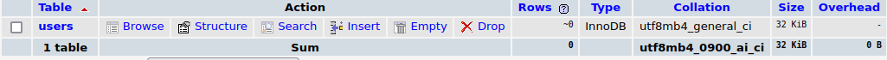
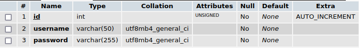

<p align="center">
  
  
# <i>Macca Computer Login System</i>
</p>

## Database setting
Follow these steps:
- Go to phpMyAdmin
- Select your database (empty)
- Go to the SQL tab
- 
- Add this code: 
```sql
CREATE TABLE `users` (
    `id` int(11) UNSIGNED NOT NULL AUTO_INCREMENT,
    `username` varchar(50) NOT NULL,
    `password` varchar(255) NOT NULL,
    PRIMARY KEY (`id`),
    UNIQUE KEY `username` (`username`)
) ENGINE=InnoDB DEFAULT CHARSET=utf8mb4 COLLATE=utf8mb4_general_ci AUTO_INCREMENT=1;
```
- Now click to the **GO** button. The output that you see is like this:
- 
- To view the structure click on the **STRUCTURE** button
- And you see this:
- 

# View the MCLS page
Open this link: https://maccacomputer.altervista.org/mcls/register.html
